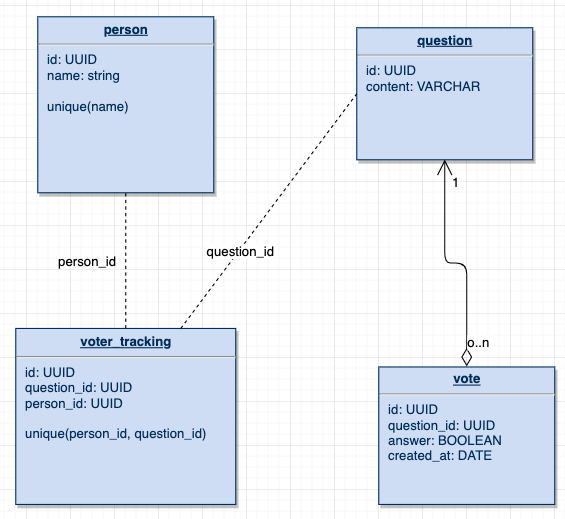

### Tools

- IntelliJ
- Visual Studio Code (for editing Markdown)
- Spring Boot 2.2.2
- Maven
- Java 13
- JDK 13.0.1
- Junit 5

### Developer

- Q Do

### SwaggerUI 

- `http://localhost:8080/swagger-ui.html`

### Web Service Endpoints

- `GET http://localhost:8080/api/v1/question/statistic`: get all questions' statistic

- `GET http://localhost:8080/api/v1/question`: get all available questions
- `GET http://localhost:8080/api/v1/question/{id}`: get a question by id
- `POST http://localhost:8080/api/v1/question`: add a question

- `GET http://localhost:8080/api/v1/person`: get all existing people
- `GET http://localhost:8080/api/v1/person/{id}`: get a person by id
- `POST http://localhost:8080/api/v1/person`: add a person

- `POST http://localhost:8080/api/v1/vote`: post a vote

### DB Diagram

### Concurrency handle

* Options: 

    * Optimistic locking: version locking. Api will not be able to update if version is mismatched.
Further, keeping track of a stateful version in a stateless web service is not ideal. It may work better in web app. 
Also, it may require exponential backoff and retry handler to retry the call in case of concurrency happens. 

    * Pessimistic locking: a row is locked by another thread until it finished  time to prevent concurrency update.

    * Queue: a popular approach for cloud app. Job/process is waiting in queue for processing. However, setting queue from scratch is tedious.

    * Java synchronization: need to research more, it sounds like a thread-level pessimistic locking handled by JVM.

* Methods:

    * Used Java synchronization
    
    * Utilized Spring Boot @transactional to handle failure
    
    * Each vote is a record to avoid mutation
  
> Note: Database can lock at table level if there are multiple transactions accessing the same table, 
it's better to handle concurrency at application level using Java synchronization.

### Things I learned

- Autowired with Spring Boot (dependency injection)
- Set up jdbc connection and sqlite dialect
- Create database seeder
- Create database migration
- application.yml (former application.properties)
- Using `NamedParameterJdbcTemplate` to create CRUD methods and bind parameters
- Using `jdbcTemplate.query` to prevent empty result exception in `jdbcTemplate.queryObject`  
- Custom Global REST API Exception Handler using `@ControllerAdvice` 
- Custom HTML Error Pages by extending `ErrorController` and importing `spring-boot-starter-thymeleaf`
- Concurrency testing using `Future`, `ExecutorService`, `CountDownLatch`
- Java synchronization
- Sqlite3 table lock
- Testing: JUnit 5, MVCmock
- Javadoc
- SwaggerUI with springfox

### TODO

- Mockito - how to mock with JUnit 5
- Pagination with limit and offset
- Batch votes
- Containerize with Postgres
